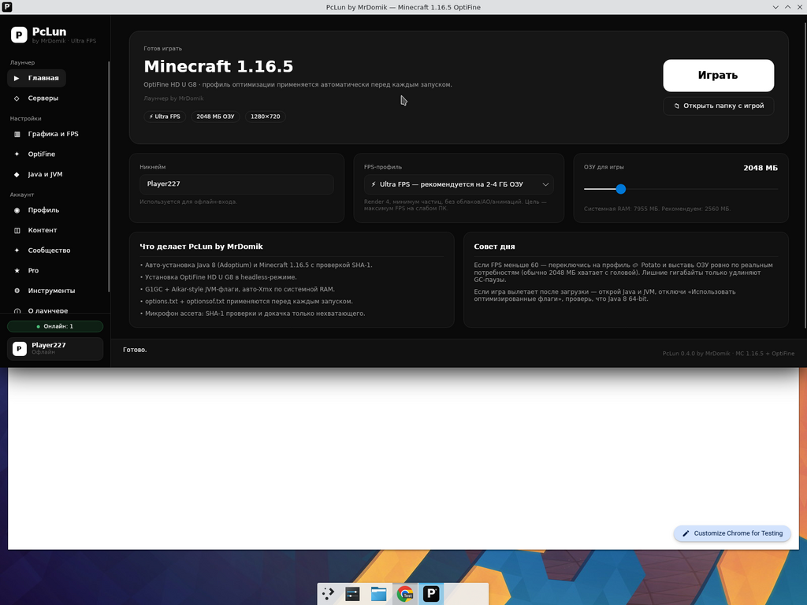
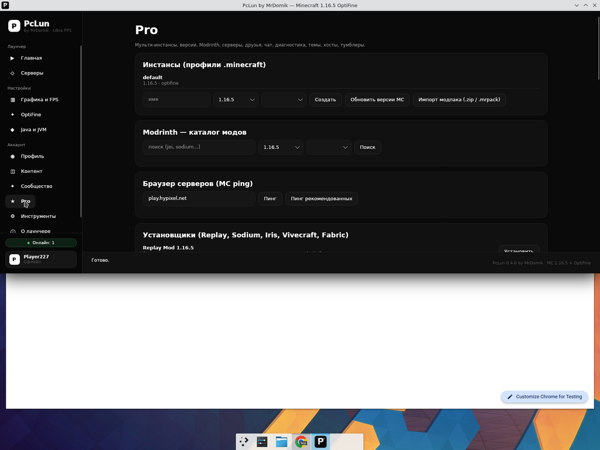
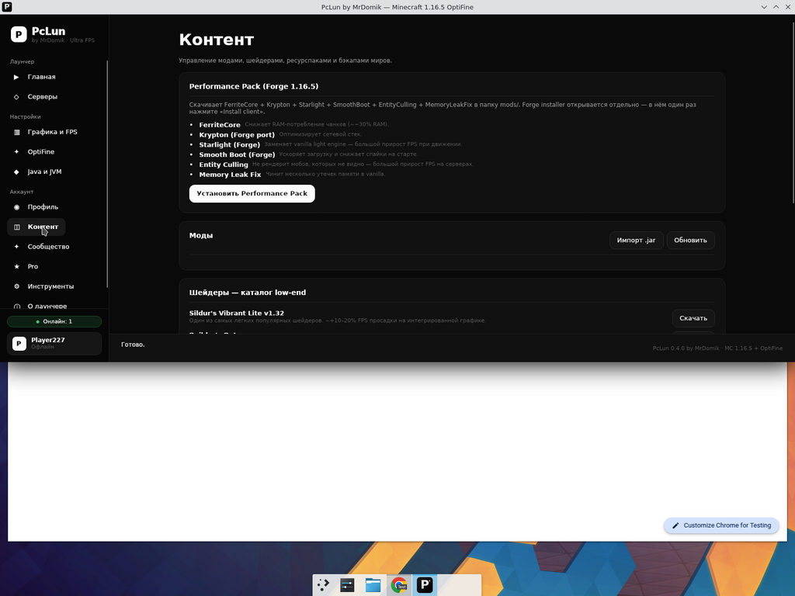
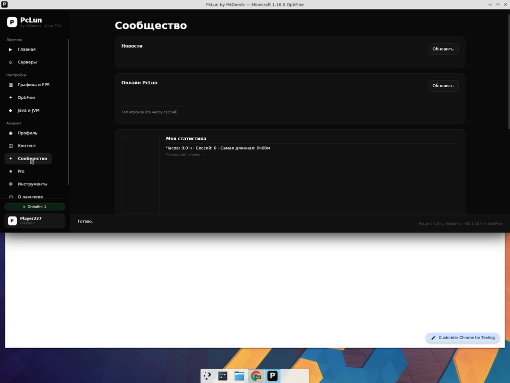
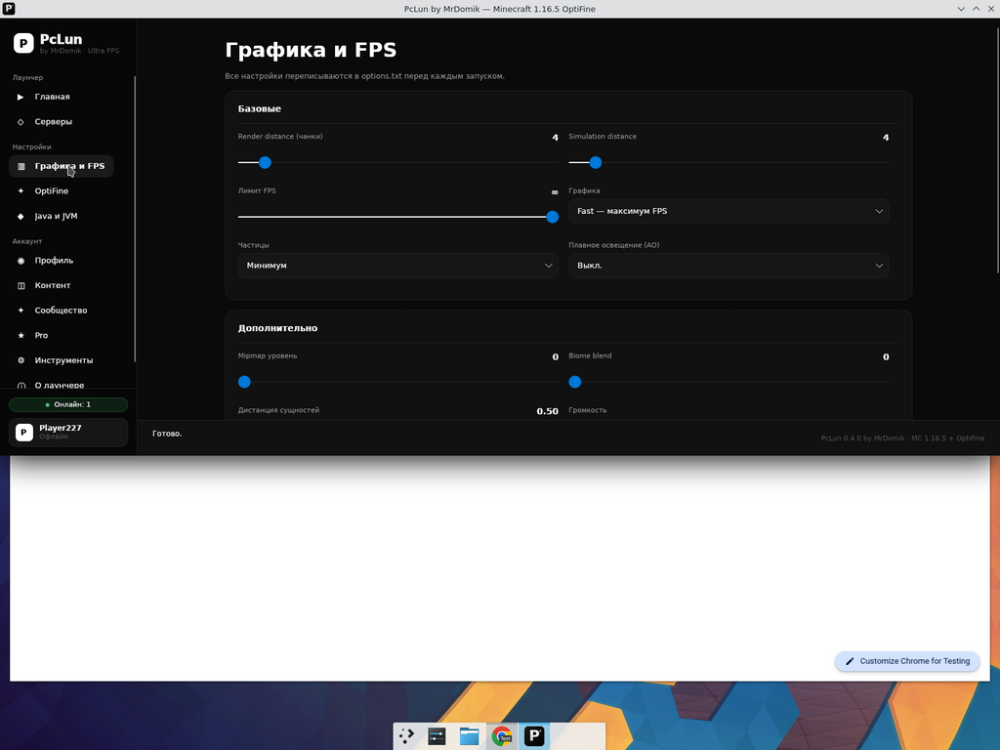
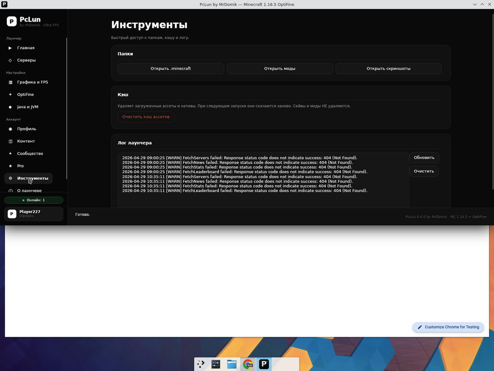

<div align="center">

# PcLun by MrDomik

### Лёгкий лаунчер Minecraft на русском — для слабых ПК

**Pro Edition · v0.4.0**

[](https://github.com/prov50686-ops/pclun/actions/workflows/build-windows.yml)
[](https://github.com/prov50686-ops/pclun/actions/workflows/build-linux.yml)
[](https://github.com/prov50686-ops/pclun/actions/workflows/build-macos.yml)
[](https://github.com/prov50686-ops/pclun/actions/workflows/format.yml)

[**📥 Скачать релиз**](https://github.com/prov50686-ops/pclun/releases/latest) · [**📰 Что нового**](./CHANGELOG.md) · [**🐞 Баг-репорт**](https://github.com/prov50686-ops/pclun/issues)

</div>

---

## 🎯 О проекте

**PcLun** — это бесплатный open-source лаунчер Minecraft, написанный полностью на русском языке для русскоязычной аудитории. Главный фокус — **слабые ПК и интегрированная графика**: лаунчер сам подберёт оптимальные настройки, выставит JVM-флаги, поставит лёгкие моды для FPS и не будет жрать ОЗУ сам.

> Сделано одним человеком. Минимализм, чёрно-белая тема, без рекламы, без аналитики (телеметрия — opt-in).

---

## 📸 Как выглядит

| Главная — запуск в один клик | Pro — мульти-инстансы, Modrinth, серверы, друзья |
|:---:|:---:|
|  |  |

| Контент — моды, шейдеры, бэкапы | Сообщество — новости, топ, статистика |
|:---:|:---:|
|  |  |

| Графика и FPS — точечная настройка | Инструменты — папки, кэш, лог |
|:---:|:---:|
|  |  |

---

## ⚡ Что умеет

### Базовое
- 🎮 **Запуск Minecraft 1.16.5 + OptiFine HD U G8** в один клик
- ☕ **Авто-установка Java 8** (Adoptium Temurin) — без вашего участия
- 🛠 **Авто-скачка** клиента, библиотек, ассетов и нативов с проверкой SHA-1
- ⚙️ **Профиль Ultra FPS** на слабых ПК: render distance = 4, без облаков, без AO, без частиц, OptiFine Fast Render / Smart Animations off / Lazy Chunk Loading
- 🧠 **Умный JVM**: G1GC + Aikar-style флаги, авто-`-Xmx` по системной RAM
- 🔐 **Два режима входа**: офлайн (любой ник) или Microsoft Account (премиум)

### Pro Edition (v0.4.0)
- 🗂 **Мульти-инстансы** — отдельный `.minecraft` под каждый профиль
- 🎯 **Любая версия Minecraft** через Mojang piston-meta (1.8.9, 1.12.2, 1.16.5, 1.18.2, 1.19.4, 1.20.1)
- 📦 **Импорт модпаков** `.zip`, `.mrpack`, CurseForge overrides
- 🔍 **Modrinth-браузер** — поиск + установка модов в один клик
- 🛰 **Браузер серверов** на нативном MC SLP-протоколе с пингом и MOTD
- 🧰 **Установщики**: Replay Mod, Sodium + Iris (Fabric), Vivecraft, Fabric Loader
- 👥 **Друзья и чат** — WebSocket-чат лаунчера
- 🏆 **Достижения PcLun** — 10 ачивок локально + синхронизация с бэкендом
- 📊 **Диагностика** — авто-FPS-профиль по железу, GPU-детектор, температура CPU, мониторинг троттлинга
- 🎨 **Темы** — светлая / тёмная / системная + кастомный hex-акцент
- 🛡 **Стример-режим** маскирует ник и IP сервера на скриншотах
- ☁️ **Облачный бэкап** миров через S3/R2 (presigned URL)

### Контент-менеджер
- 🚀 **Performance Pack** в один клик: FerriteCore + Krypton + Starlight + SmoothBoot + EntityCulling + MemoryLeakFix
- 🌑 **Каталог low-end шейдеров** (Sildur's Vibrant Lite, Builder's QoL и др.)
- 🧩 **Менеджер модов** — drag-drop, вкл/выкл одной галочкой, удаление
- 💾 **Бэкап миров** — снимок `saves/` в zip + восстановление
- 🖼 **Галерея скриншотов** прямо в лаунчере
- 🔄 **Импорт/экспорт настроек** в JSON

### Сообщество и сервис
- 📰 **Новости** из своего бэкенда
- 👤 **Топ игроков** по числу сессий
- 💬 **Анализатор краш-логов** — парсит `crash-reports/`, подсвечивает причину и предлагает фикс
- 🟢 **Discord Rich Presence** — «Играет в PcLun · 1 ч 23 м»
- 🔔 **Авто-апдейт лаунчера** через GitHub Releases

---

## 📥 Скачать

[**Перейти на страницу релизов**](https://github.com/prov50686-ops/pclun/releases/latest)

Готовые сборки для всех платформ:

| Платформа | Файл | Описание |
|---|---|---|
| 🪟 Windows | `PcLun.exe` | Single-file, портативная (~70 МБ) |
| 🪟 Windows | `PcLun-0.4.0.msi` | Классический инсталлятор |
| 🐧 Linux x64 | `PcLun-linux-x64` | Self-contained binary |
| 🐧 Debian/Ubuntu | `pclun_0.4.0_amd64.deb` | `sudo dpkg -i pclun_0.4.0_amd64.deb` |
| 🐧 Fedora/RHEL | `pclun-0.4.0-1.x86_64.rpm` | `sudo dnf install ./pclun-0.4.0-1.x86_64.rpm` |
| 🍎 macOS Intel | `PcLun-osx-x64` | `chmod +x PcLun-osx-x64 && ./PcLun-osx-x64` |
| 🍎 macOS Apple Silicon | `PcLun-osx-arm64` | M1/M2/M3 |

---

## 🛠 Сборка из исходников

Нужен **.NET 8 SDK**.

```bash
git clone https://github.com/prov50686-ops/pclun
cd pclun
dotnet publish src/Launcher/Launcher.csproj -c Release -r win-x64 \
    --self-contained true \
    -p:PublishSingleFile=true \
    -p:IncludeNativeLibrariesForSelfExtract=true \
    -p:EnableCompressionInSingleFile=true \
    -o publish/win-x64
./publish/win-x64/PcLun
```

Замените `win-x64` на `linux-x64`, `osx-x64` или `osx-arm64` для других платформ.

### Запуск тестов

```bash
dotnet test
```

### Проверка форматирования

```bash
dotnet format --verify-no-changes
```

---

## 🗂 Структура проекта

```text
src/Launcher/                  # Avalonia UI (.NET 8)
  Services/
    Paths.cs                   # пути к рантайму
    SystemInfo.cs              # детекция RAM/CPU/GPU
    Http.cs                    # HTTP + SHA1
    MinecraftDownloader.cs     # скачка vanilla 1.16.5+
    VersionManager.cs          # piston-meta / любые версии MC
    JavaManager.cs             # авто-скачка Adoptium Temurin JRE
    OptifineInstaller.cs       # OptiFine headless installer
    OptimizationProfile.cs     # JVM-флаги, options.txt, optionsof.txt
    GameLauncher.cs            # сборка classpath и финальной команды
    InstanceManager.cs         # мульти-инстансы
    ModrinthClient.cs          # поиск/установка модов с Modrinth
    ServerPinger.cs            # MC SLP протокол (handshake + status)
    LoaderInstallers.cs        # Replay/Sodium+Iris/Vivecraft/Fabric
    CapeService.cs             # MSA cape API
    ChatClient.cs              # WebSocket-чат
    FriendsService.cs
    AchievementService.cs
    Diagnostics.cs             # GPU/temp/auto-FPS-profile
    ThemeService.cs            # тема + custom акцент
    AutostartService.cs        # tray + autostart
    StreamerMode.cs
    Notifier.cs
    BackupService.cs           # локальные бэкапы миров
    CloudBackupService.cs      # S3/R2 presigned upload
    TelemetryService.cs        # opt-in анонимная Sentry-style
    ContentManager.cs          # Performance Pack + шейдеры
    CrashAnalyzer.cs           # парсер crash-reports
    DiscordRpcService.cs
    ModpackImporter.cs         # .zip / .mrpack / CurseForge
    ModConflictDetector.cs     # mods.toml + fabric.mod.json
    AntiCheatSelfTest.cs
    HostsEditor.cs
    AuthService.cs             # offline + MS Device Code
    OnlineService.cs           # пинг бэкенда онлайна
  ViewModels/
    MainViewModel.cs
    ProViewModel.cs            # surface вкладки Pro
  Views/MainWindow.axaml
  Styles/Theme.axaml

backend/                       # FastAPI бэкенд (Fly.io)
  main.py                      # /heartbeat, /online, /news, /servers, /leaderboard,
                               # /telemetry, /friends, /achievements, /backup/presign,
                               # WS /chat, /site/changelog
  pyproject.toml

packaging/                     # MSI / .deb / .rpm / WinGet / Chocolatey / Homebrew / CF Pages

tests/Launcher.Tests/          # xUnit тесты (28 штук)

.github/workflows/             # build-windows, build-linux, build-macos,
                               # package-deb-rpm, package-msi, format
```

---

## 🌐 Бэкенд

Развёрнут на Fly.io: <https://pclun-online-trloyqbz.fly.dev/>

| Эндпоинт | Что делает |
|---|---|
| `POST /heartbeat {"username": "..."}` | Пинг от лаунчера. Возвращает `{online, total}` |
| `GET /online` | Публичная статистика онлайна |
| `GET /news` | Лента новостей лаунчера |
| `GET /servers/featured` | Динамический список рекомендованных серверов |
| `GET /leaderboard` | Топ-10 игроков по числу сессий |
| `GET /stats/{nick}` | Статистика конкретного игрока |
| `POST /telemetry` | Анонимная opt-in телеметрия (краши, FPS) |
| `POST /friends/add` · `/friends/remove` · `GET /friends/{nick}` | Друзья |
| `POST /achievements/unlock` · `GET /achievements/{nick}` | Достижения |
| `POST /backup/presign` | Получить presigned URL S3/R2 для облачного бэкапа |
| `WS /chat?nick=...` | Чат лаунчера (broadcast hub + 30 сообщений истории) |
| `GET /site/changelog` | Публичный HTML changelog для встройки на сайт |

---

## 📁 Папки данных

| ОС | Путь |
|---|---|
| Windows | `%APPDATA%\PcLun\` |
| Linux | `~/.config/PcLun/` или `~/.local/share/PcLun/` |
| macOS | `~/Library/Application Support/PcLun/` |

Внутри:

```
runtime/jre8/        — встроенная Java
minecraft/           — основной .minecraft (versions, libraries, assets, saves, mods)
instances/           — дополнительные профили (Pro Edition)
accounts.json        — сохранённые аккаунты
backups/             — локальные снимки миров
launcher.log
settings.json
```

---

## ❓ Частые вопросы

<details>
<summary><b>Можно ли играть без премиум-аккаунта?</b></summary>

Да. На вкладке **Профиль** можно ввести любой ник в офлайн-режиме. На пиратские сервера он зайдёт без проблем.
</details>

<details>
<summary><b>На каких ПК идёт?</b></summary>

Минимум: 2-ядерный CPU, 4 ГБ ОЗУ, **Intel HD 4000 / Radeon HD 4000 и новее**. Авто-FPS-профиль сам выберет настройки. Лаунчер тестировался на ноутбуках 2010-х годов и спокойно даёт 30-60 FPS в Minecraft 1.16.5 на Ultra FPS.
</details>

<details>
<summary><b>Это правда безопасно?</b></summary>

Да. Код полностью открытый, [исходники тут](https://github.com/prov50686-ops/pclun). Все бинари собираются на GitHub Actions (можно проверить хэши). Телеметрия выключена по умолчанию.
</details>

<details>
<summary><b>Почему MSI/EXE не подписан?</b></summary>

Authenticode-сертификат стоит ~$200/год; пока не оплатил. Windows SmartScreen может ругнуться при первом запуске — нажмите «Подробнее → Выполнить в любом случае».
</details>

<details>
<summary><b>Где сохранить настройки чтобы перенести на другой ПК?</b></summary>

Вкладка **Сообщество** → блок **Импорт/Экспорт настроек** → кнопка «Экспорт». Получите один JSON-файл, перенесите его, импортируйте на новом ПК.
</details>

---

## 🤝 Помочь проекту

- ⭐ Поставьте звезду на GitHub
- 🐞 Сообщайте о багах в [Issues](https://github.com/prov50686-ops/pclun/issues)
- 🔧 PR с фиксами/фичами всегда приветствуются
- 💬 Обсуждение в [Discussions](https://github.com/prov50686-ops/pclun/discussions)

---

## 📜 Лицензия

[MIT](./LICENSE) — используйте, форкайте, модифицируйте.

OptiFine, Minecraft и связанные товарные знаки принадлежат их правообладателям. Этот лаунчер — независимый open-source проект, не аффилирован с Mojang/Microsoft.

---

<div align="center">

**Сделано с ☕ и Avalonia · MrDomik · 2026**

</div>
